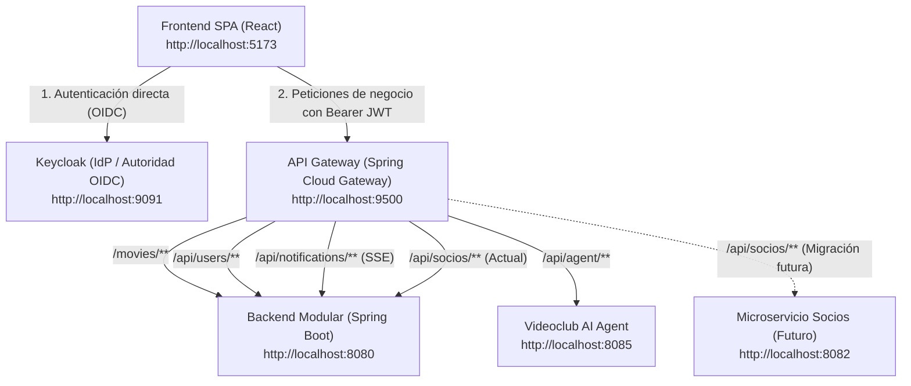

# API Gateway - Videoclub

Este repositorio implementa el **API Gateway** para la plataforma de microservicios y servicios modulares del sistema **Videoclub**. Está construido sobre **Spring Cloud Gateway 5 (WebFlux / Netty)**, **Spring Boot 4.1.1** y **Java 25**.

Actúa como el **punto único de entrada (Single Point of Entry)** en el plano de datos (*Data Plane*) para los clientes frontales (SPA React), centralizando el enrutamiento de recursos, la resolución de CORS y la desacoplación de la topología interna de la red.

---

## Requisitos Previos

- **Java 25** (OpenJDK / Eclipse Temurin / GraalVM). El proyecto incluye archivo `.sdkmanrc` para sincronización automática con SDKMAN (`sdk env`).
- **Maven 3.9+** (o el wrapper `./mvnw` incluido).
- **Docker** y **Docker Compose** (para ejecución contenerizada).

---

## Arquitectura de Red y Flujo de Tráfico

El API Gateway expone una **fachada orientada a recursos (Resource-Oriented Facade)**: los clientes frontales interactúan con URLs que representan entidades del dominio (`/movies`, `/api/socios`, `/api/agent`), ignorando puertos internos o ubicaciones de contenedores.

El plano de identidad (**Keycloak**) opera de forma desacoplada y fuera del Gateway para preservar la integridad del claim `iss` (Issuer) de los tokens JWT de acuerdo con la especificación OpenID Connect Core 1.0.



---

## Tabla de Rutas Activas

| ID de Ruta | Predicado (`Path`) | Destino por Defecto | Variable de Entorno | Filtros Aplicados |
| :--- | :--- | :--- | :--- | :--- |
| `service-catalogo` | `/movies/**` | `http://localhost:8080` | `CATALOGO_URI` | `DedupeResponseHeader` |
| `service-socios` | `/api/socios/**` | `http://localhost:8080` | `SOCIOS_URI` | `DedupeResponseHeader` |
| `service-users` | `/api/users/**` | `http://localhost:8080` | `USERS_URI` | `DedupeResponseHeader` |
| `service-notificaciones` | `/api/notifications/**` | `http://localhost:8080` | `NOTIFICACIONES_URI` | `DedupeResponseHeader` |
| `agent-service` | `/api/agent/**` | `http://localhost:8085` | `AGENT_URI` | `DedupeResponseHeader` |

> [!NOTE]
> Las rutas aplican el filtro `DedupeResponseHeader=Access-Control-Allow-Origin Access-Control-Allow-Credentials, RETAIN_UNIQUE`. Esto previene la duplicación de cabeceras CORS cuando tanto el Gateway como los servicios downstream las emiten, cumpliendo con la especificación W3C / Fetch Standard.

---

## Configuración (Spring Cloud Gateway 5)

A partir de **Spring Cloud Gateway 5.x / Spring Cloud 2025.x**, el espacio de nombres canónico para la versión reactiva es `spring.cloud.gateway.server.webflux` (separado de la variante MVC).

### Ejemplo de `src/main/resources/application.yml`

```yaml
server:
  port: 9500

spring:
  application:
    name: api-gateway
  cloud:
    gateway:
      server:
        webflux:
          globalcors:
            cors-configurations:
              '[/**]':
                allowedOriginPatterns: "*"
                allowedMethods: "*"
                allowedHeaders: "*"
                allowCredentials: true
          routes:
            - id: service-catalogo
              uri: ${CATALOGO_URI:http://localhost:8080}
              predicates:
                - Path=/movies/**
              filters:
                - DedupeResponseHeader=Access-Control-Allow-Origin Access-Control-Allow-Credentials, RETAIN_UNIQUE

            - id: agent-service
              uri: ${AGENT_URI:http://localhost:8085}
              predicates:
                - Path=/api/agent/**
              filters:
                - DedupeResponseHeader=Access-Control-Allow-Origin Access-Control-Allow-Credentials, RETAIN_UNIQUE
```

---

## Ejecución Local

1. Configurar la versión de Java indicada en `.sdkmanrc`:
   ```bash
   sdk env
   # o alternativamente:
   sdk use java 25.0.3-tem
   ```

2. Compilar y ejecutar con Maven:
   ```bash
   ./mvnw spring-boot:run
   ```

3. El Gateway iniciará en `http://localhost:9500`.

4. Ejecutar pruebas automatizadas:
   ```bash
   ./mvnw clean test
   ```

---

## Despliegue con Docker y Docker Compose

### Uso en Compose con Montaje de Configuración

En entornos Docker Compose (como en `springboot-sso/docker/apigateway.yaml`), se suele montar externamente el archivo de rutas `gateway.yml`:

```yaml
name: videoclub
services:
  gateway:
    image: registry.gitlab.com/public-unrn/apigateway:1.0
    container_name: videoclub-gateway
    ports:
      - "9500:9500"
    extra_hosts:
      - "host.docker.internal:host-gateway"
    volumes:
      - ./gateway/gateway.yml:/workspace/config/application.yml:ro
```

- **`extra_hosts`**: Permite al contenedor en entornos Linux resolver `host.docker.internal` hacia el host de desarrollo donde se ejecuta el backend (`springboot-sso`).
- **Volumen `/workspace/config/application.yml`**: Sobrescribe la configuración empaquetada permitiendo ajustar endpoints sin reconstruir la imagen.

---

## Compilación de Imagen Nativa (GraalVM AOT)

El proyecto incluye soporte para **GraalVM Native Image** mediante `native-maven-plugin` y los buildpacks de Spring Boot:

```bash
# Construir imagen de contenedor OCI optimizada con GraalVM Native Image
./mvnw spring-boot:build-image -Pnative

# O compilar binario nativo ejecutable local en target/
./mvnw native:compile -Pnative
```

> [!IMPORTANT]
> Las imágenes GraalVM AOT generan un binario estático cerrado en tiempo de compilación. Cualquier filtro dependiente de beans reactivos dinámicos (como `RequestRateLimiter` con Redis) debe contar con sus dependencias analizadas durante el paso AOT.
